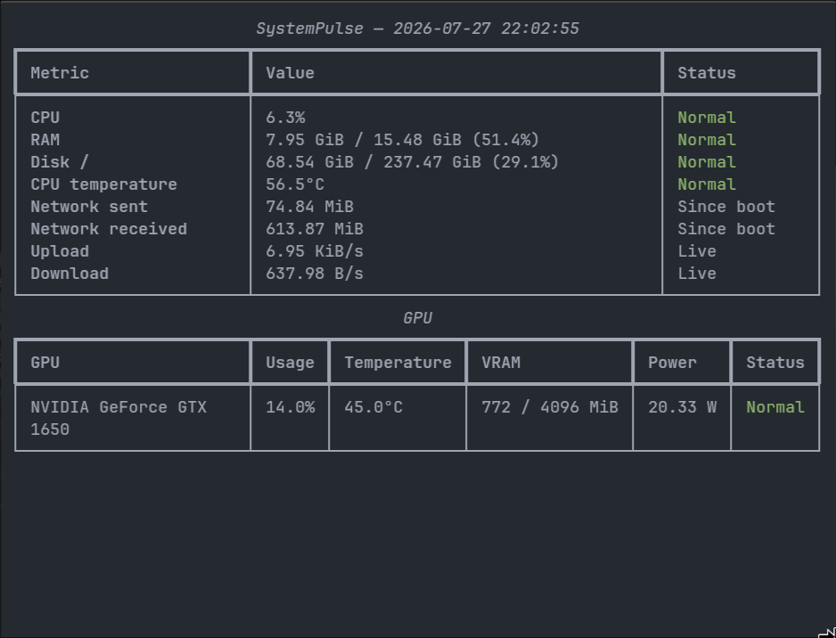
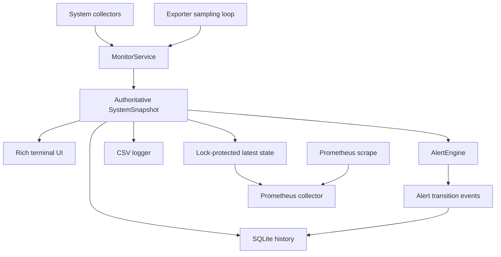

# SystemPulse

[](https://github.com/guptaoni891-ctrl/systempulse/actions/workflows/tests.yml)

[](LICENSE)

SystemPulse is a lightweight cross-platform system monitoring and observability CLI for Windows,
macOS, and Linux. It combines a Rich terminal dashboard with configurable alerts, local SQLite
history, CSV export, and an optional Prometheus endpoint—without requiring a background daemon or
web application.

Use it for an immediate view of host health, a live terminal dashboard, local metric history, or a
small Prometheus target on a workstation or server.

## Dashboard



The existing capture accurately represents the core dashboard layout. It predates the current
active-alert panel, so a present-day `systempulse live` session includes an additional Alerts
section. See [docs/demo.md](docs/demo.md) for a safe, reproducible demo-capture workflow.

## Quick start

SystemPulse is not yet published to PyPI. Install the current project from source:

```bash
git clone https://github.com/guptaoni891-ctrl/systempulse.git
cd systempulse
python -m pip install -e .
```

Then open the menu, live dashboard, or a one-time snapshot:

```bash
systempulse
systempulse live
systempulse snapshot
```

Install the optional exporter dependencies from the source checkout when Prometheus support is
needed:

```bash
python -m pip install -e ".[prometheus]"
systempulse serve
```

After a future PyPI release, installation will become:

```bash
pip install systempulse
pip install "systempulse[prometheus]"  # only when exporter support is needed
```

These PyPI commands are release instructions, not a claim that version 2.0 is currently published.
For virtual-environment setup on each platform, see [Installation from source](#installation-from-source).

## Features

- CPU, memory, system-disk, and network monitoring.
- Network totals since boot and upload/download rate calculation.
- CPU temperature when the operating system exposes a usable sensor through `psutil`.
- Top CPU-consuming processes.
- NVIDIA GPU usage, temperature, VRAM, and optional power through `nvidia-smi`.
- Multiple NVIDIA GPUs represented independently in snapshots, alerts, history, and Prometheus.
- Rich one-shot and live terminal views with configurable status thresholds.
- Stateful alerts with duration, hysteresis, cooldown, escalation, and recovery transitions.
- Transactional SQLite snapshot, GPU, and durable alert-event history with retention.
- CSV snapshot logging and custom output paths.
- Optional scrape-decoupled Prometheus exporter.
- Typed, validated JSON configuration with OS-specific config and data locations.
- Python 3.11–3.13 support with cross-platform CI, static typing, and enforced branch coverage.

## Platform support

| Platform | Core metrics | CPU temperature | NVIDIA GPU |
|---|---|---|---|
| Windows 10/11 | Supported | Available only when exposed through `psutil` | Requires `nvidia-smi` |
| macOS | Supported | Often unavailable through `psutil` | Generally unavailable on modern Macs |
| Linux | Supported | Commonly available when supported sensors are exposed | Requires `nvidia-smi` |

Missing sensors or GPU tooling are reported as unavailable; they do not prevent core monitoring.
Use `--no-gpu` to skip NVIDIA detection explicitly.

## CLI reference

Global options must appear before the command:

```text
--config PATH   use an explicit JSON configuration
--no-gpu        skip NVIDIA GPU collection
--version       print the installed version
```

### Monitor the host

| Command | Purpose |
|---|---|
| `systempulse` | Open the interactive menu. |
| `systempulse menu` | Open the same menu explicitly. |
| `systempulse live` | Run the continuously updating dashboard until interrupted. |
| `systempulse snapshot` | Render one authoritative system snapshot. |
| `systempulse processes --limit 10` | Show processes sorted by sampled CPU usage. |
| `systempulse network` | Show cumulative sent/received counters since boot. |
| `systempulse network --speed` | Measure current upload and download rates. |
| `systempulse --no-gpu snapshot` | Collect a snapshot without running `nvidia-smi`. |

The installed module entry point is equivalent, for example `python -m systempulse snapshot`.

### Alerts and history

| Command | Purpose |
|---|---|
| `systempulse alerts` | Show configured alert rules and the runtime-state limitation. |
| `systempulse alerts --history --limit 20` | Show recent durable alert transitions. |
| `systempulse history --limit 10` | Show a history summary and recent samples. |
| `systempulse history --hours 24 --limit 20` | Restrict history to recent hours. |
| `systempulse history --days 7` | Restrict history to recent days. |

`--hours` and `--days` are mutually exclusive. Active alerts exist only in the live process; durable
transition history is stored separately in SQLite. See [docs/alerts.md](docs/alerts.md) and
[docs/history.md](docs/history.md).

### Save and export

| Command | Purpose |
|---|---|
| `systempulse save` | Append one sampled reading to the configured CSV file. |
| `systempulse save --output logs/readings.csv` | Override the CSV destination. |
| `systempulse serve` | Serve current metrics at `127.0.0.1:9100/metrics`. |
| `systempulse serve --host 0.0.0.0 --port 9200 --interval 2` | Override exporter binding and sampling interval. |

Prometheus support requires the `prometheus` extra. Binding beyond `127.0.0.1` exposes host metrics
to reachable clients and should be an explicit decision. See
[docs/prometheus.md](docs/prometheus.md).

### Inspect and update configuration

| Command | Purpose |
|---|---|
| `systempulse show-config` | Print the effective configuration; legacy alias for `config show`. |
| `systempulse config show` | Print the effective validated configuration. |
| `systempulse config path` | Print the selected or default user config path. |
| `systempulse config init` | Create a complete user configuration without replacing an existing file. |
| `systempulse config init --force` | Replace the target configuration intentionally. |
| `systempulse config set cpu.warning 70` | Validate and update one supported setting. |
| `systempulse --config custom.json config show` | Use an explicit configuration path. |

Configuration precedence, every supported key, and a complete valid example are documented in
[docs/configuration.md](docs/configuration.md).

## Architecture



Collectors gather raw host data. `MonitorService` combines it into one immutable, UTC-stamped
`SystemSnapshot`; presentation and persistence components consume that snapshot rather than
collecting independently. `AlertEngine` evaluates state transitions but never polls hardware.

The exporter has its own monotonic sampling loop that updates lock-protected latest state.
Prometheus scrapes read that state and never call `MonitorService`, `psutil`, or `nvidia-smi`.
SQLite is a separate sink and does not feed Prometheus. See
[docs/architecture.md](docs/architecture.md) for module boundaries and design guarantees.

## Installation from source

SystemPulse requires Python 3.11, 3.12, or 3.13.

### Windows PowerShell

```powershell
git clone https://github.com/guptaoni891-ctrl/systempulse.git
cd systempulse
py -m venv .venv
.venv\Scripts\Activate.ps1
python -m pip install --upgrade pip
python -m pip install -e ".[dev]"
```

### Linux and macOS

```bash
git clone https://github.com/guptaoni891-ctrl/systempulse.git
cd systempulse
python3 -m venv .venv
source .venv/bin/activate
python -m pip install --upgrade pip
python -m pip install -e ".[dev]"
```

The `dev` extra includes the optional Prometheus dependency so the complete test suite can exercise
both normal exporter behavior and missing-dependency behavior. Runtime users can install `.` or
`.[prometheus]` instead.

## Documentation

- [Configuration](docs/configuration.md)
- [Alerts](docs/alerts.md)
- [SQLite history](docs/history.md)
- [Prometheus exporter](docs/prometheus.md)
- [Architecture](docs/architecture.md)
- [Development and CI](docs/development.md)
- [Demo capture](docs/demo.md)
- [Contributing](CONTRIBUTING.md)
- [Security policy](SECURITY.md)
- [Changelog](CHANGELOG.md)

## Engineering quality

The repository enforces branch coverage at 90% and currently maintains more than 90% coverage. CI
separates quality checks, the supported Python/OS test matrix, and clean package validation. Local
commands are documented in [docs/development.md](docs/development.md).

Important boundaries include immutable authoritative snapshots, monotonic interval scheduling,
timezone-aware UTC persistence, transactional SQLite writes, bounded Prometheus labels, optional
exporter dependencies, and no scrape-triggered hardware collection.

## License

SystemPulse is available under the [MIT License](LICENSE).
