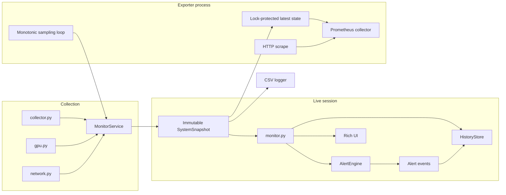

# Architecture

SystemPulse is organized around a small data-flow boundary: each collection cycle produces one
immutable `SystemSnapshot`, and downstream components consume that snapshot without recollecting
host data.

SQLite does not feed Prometheus. Prometheus scrapes do not point back to collection.

## Core design decisions

### One authoritative snapshot per cycle

`MonitorService` is the only component that combines core metrics, network-rate state, GPU results,
diagnostics, and wall-clock time into a complete `SystemSnapshot`. The snapshot is frozen and uses a
timezone-aware UTC timestamp.

This avoids the inconsistency that occurs when a UI, CSV logger, alert engine, and database each
poll the machine at slightly different times. Each sink receives the same values for a given cycle.

### Collection and consumption are separate

Collectors return typed values and lightweight diagnostics. They do not render output, write files,
evaluate alerts, or know about Prometheus. Conversely, `AlertEngine`, `HistoryStore`, the Rich UI,
and the CSV logger do not poll hardware.

### Scrapes never trigger collection

The exporter owns a monotonic sampling thread. Successful snapshots atomically replace a
lock-protected state object. The Prometheus collector serializes that state during a scrape, so
scrape frequency cannot cause additional `psutil` or `nvidia-smi` calls.

### Wall time and elapsed time have different jobs

- Timezone-aware UTC timestamps identify snapshots and persisted events.
- Monotonic clocks calculate network rates, alert duration and cooldown, dashboard target ticks,
  exporter target ticks, and sample age.

Monotonic timing avoids negative or stretched intervals when the system wall clock changes.

## Module responsibilities

### `collector.py`

Collects non-GPU host metrics through `psutil`: CPU, memory, system-disk usage, optional CPU
temperature, and network totals. It selects the Windows system drive or `/` on Unix-like systems and
returns diagnostics when optional temperature data cannot be obtained.

It does not assign snapshot timestamps or calculate network rates.

### `gpu.py`

Runs `nvidia-smi` with a bounded timeout, requests a fixed CSV field set, validates each row, and
returns zero or more `GPUStats` objects. Missing commands, timeouts, non-zero exits, empty output,
and malformed rows become diagnostics instead of terminating core monitoring.

The parser supports multiple output rows. GPU power is optional.

### `network.py`

Wraps cumulative OS network counters and calculates non-negative rates from two observations and a
positive elapsed interval. Counter resets are clamped to zero for instantaneous rate calculation.

### `service.py`

`MonitorService` orchestrates collectors and creates authoritative snapshots. Its only retained
sampling state is the previous network counter observation and its monotonic timestamp. The first
ordinary sample has zero rates; later samples calculate rates from the prior authoritative sample.

`sample_with_network_rate()` establishes an earlier counter when necessary, waits once, and then
returns one complete snapshot for commands such as network speed and CSV save.

### `models.py`

Defines frozen typed value objects for core metrics, GPUs, snapshots, diagnostics, alerts, history,
network rates, and processes. `SystemSnapshot`, alert events, active alerts, summaries, and historical
samples normalize aware timestamps to UTC.

### `alerts.py`

Implements a process-local state machine over snapshots. It owns pending duration, current severity,
hysteresis recovery, cooldown, active alerts, and bounded recent events for each metric identity.

It never collects metrics or writes SQLite. Multiple GPUs receive independent index-based metric
identities. Missing active metrics hold their state rather than generating false recovery.

### `history.py`

Owns SQLite initialization, schema version checks, transactional snapshot/GPU/event writes,
retention, summaries, recent-sample queries, and durable alert-event queries. It accepts already
collected snapshots and events and has no collector dependencies.

Foreign-key relationships keep child GPU and alert rows associated with one snapshot. Storage
errors are translated into `HistoryError` with the affected database path and operation.

### `exporter.py`

Keeps `prometheus-client` behind a runtime optional-import boundary. It defines exporter health
state, an atomic latest-snapshot view, the custom Prometheus collector, the anchored sampling loop,
and HTTP server lifecycle.

The registry is dedicated to SystemPulse rather than using the default global registry. Metric
labels are deliberately bounded; no process names, GPU names, diagnostics, or error text become
labels.

### `monitor.py`

Runs the live Rich display on anchored monotonic target ticks. Slow collection skips missed ticks
instead of replaying them. For each cycle it evaluates alerts, attempts one transactional history
write, and renders the same snapshot and active-alert state.

History failures disable further persistence for that session while leaving monitoring active.

### `ui.py`

Builds Rich tables and panels for snapshots, active alerts, history summaries, alert history,
processes, and warnings. It remains presentation-focused and receives typed data from other modules.

### `logger.py`

Appends one `SystemSnapshot` to CSV, creates parent directories, and writes a header for a new or
empty file. For backward-compatible CSV shape, the current format records the first GPU only;
SQLite and Prometheus represent every GPU independently.

### `config.py`

Defines frozen configuration dataclasses, strict JSON validation, default merging, atomic config
writes, initialization, and the supported `config set` mapping. Presentation thresholds and
stateful alert rules are intentionally separate.

### `paths.py`

Uses `platformdirs` for OS-appropriate user configuration and data locations. It implements config
precedence across explicit paths, `SYSTEMPULSE_CONFIG`, legacy local configuration, user
configuration, and defaults.

### `cli.py`

Defines the argparse command surface, validates CLI-only overrides, loads configuration, creates the
needed services or stores, dispatches commands, and maps controlled failures to exit codes. It does
not contain collector logic.

## Failure boundaries

- Optional sensor and GPU failures become diagnostics and leave core monitoring usable.
- Configuration errors fail before monitoring with exit code 2.
- Direct history errors use exit code 3; live history failures degrade to a visible warning.
- Exporter and system-operation errors use exit code 1.
- A top-level keyboard interrupt returns 130, while the live monitor handles interruption cleanly.

These boundaries keep unavailable optional telemetry separate from invalid configuration or failed
required operations.
